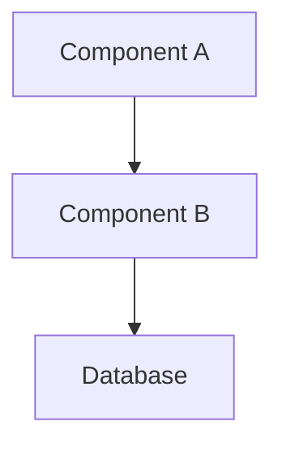

# Generate Design Document

Creates a comprehensive technical design document based on approved requirements.

## Overview

- Translates requirements into technical architecture
- Includes component design, data models, and interfaces
- Uses diagrams for visualization
- Requires approval before moving to tasks phase

## Process Flow

1. **Analyze Requirements**
   - Review approved reqs.md thoroughly
   - Identify technical constraints
   - Consider existing system architecture

2. **Design Architecture**
   - High-level component design
   - Integration points
   - Data flow diagrams
   - Technology choices with rationale

3. **Detail Components**
   - Interface definitions
   - Data models/schemas
   - API contracts
   - Error handling strategies

4. **Include Testing Strategy**
   - Unit test approach
   - Integration test plan
   - Performance test considerations

5. **Request Approval**
   - Present design for review
   - Address feedback
   - Get explicit approval before tasks

## Design Template Structure

```markdown
# Design: [Module Name]

## Overview
[Technical overview linking back to requirements]

## Architecture

### High-Level Design
[Component diagram or description]



### Technology Stack
- [Technology 1]: [Rationale]
- [Technology 2]: [Rationale]

## Components

### Component 1: [Name]
**Purpose**: [What it does]
**Responsibilities**:
- [Responsibility 1]
- [Responsibility 2]

**Interface**:
```language
interface ComponentInterface {
    method1(param: Type): ReturnType;
    method2(param: Type): ReturnType;
}
```

### Component 2: [Name]
[Continue pattern...]

## Data Models

### Model 1: [Name]
```language
class/type ModelName {
    field1: Type;
    field2: Type;
    // ...
}
```

## API Design

### Endpoint 1: [Name]
- **Method**: POST/GET/PUT/DELETE
- **Path**: `/api/resource`
- **Request**: [Schema]
- **Response**: [Schema]
- **Errors**: [Error codes and meanings]

## Error Handling

### Error Strategy
- [How errors are handled]
- [Error response format]
- [Logging approach]

## Security Considerations
- [Authentication approach]
- [Authorization strategy]
- [Data validation]

## Testing Strategy

### Unit Tests
- [What will be unit tested]
- [Testing approach]

### Integration Tests
- [Integration test scenarios]
- [Test data strategy]

## Performance Considerations
- [Expected load]
- [Optimization strategies]
- [Caching approach]

## Migration Plan (if applicable)
- [Steps to migrate from existing system]
- [Backward compatibility]
```

## Usage Examples

```bash
# Generate design for module with approved requirements
/spec-design user-authentication

# Update existing design
/spec-design payment-processing
```

## Rules/Restrictions

- MUST have approved requirements first
- Cannot proceed to tasks without design approval
- Include all components referenced in requirements
- Consider existing system patterns and conventions
- Use diagrams where helpful for clarity

## Next Steps

After design is approved:
1. Use `/spec-tasks` to generate implementation tasks
2. Tasks will reference specific design sections
3. Implementation follows the approved design